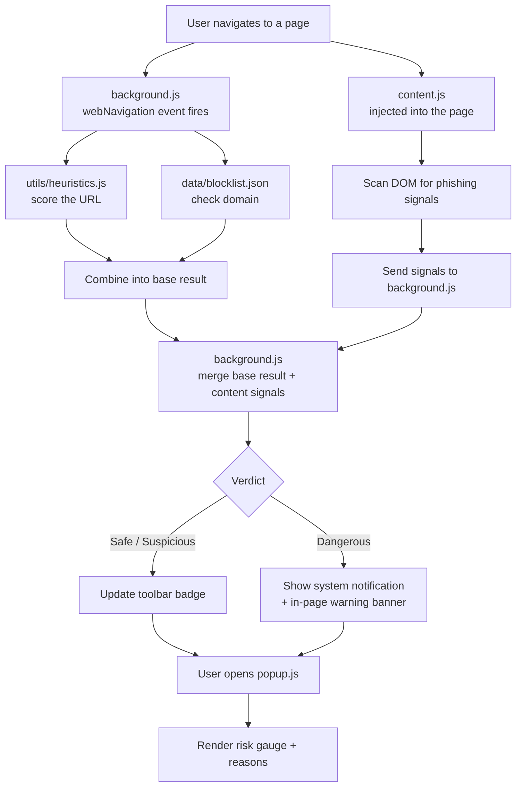

# Phishing Detector — Chrome Extension

A Chrome extension (Manifest V3) that scans the pages you visit for phishing
indicators, combining **heuristic URL/page analysis** with a **local
blocklist** of known-bad domains.

## Features

- 🔍 **URL heuristics** — flags IP-based URLs, `@` redirect tricks, excessive
  subdomains, suspicious TLDs, non-HTTPS pages, and typosquatted brand names
  (e.g. `paypa1.com`, `amaz0n-support.top`)
- 📄 **Page-content checks** — detects login forms that submit to a different
  domain than the page itself, password fields on non-HTTPS pages, and brand
  mentions that don't match the actual domain
- 🚫 **Blocklist matching** — checks the domain against a local list of known
  phishing sites (`data/blocklist.json`), designed to be swapped for a real
  feed like OpenPhish or PhishTank
- 🎚️ **5-level risk gauge** — popup shows a Very Low → Severe risk gauge with
  the specific reasons a site was flagged, instead of a flat safe/unsafe flag
- 🔔 **Proactive alerts** — dangerous pages trigger a system notification and
  an in-page warning banner automatically, with a one-click "Leave This Site"
  action — no need to open the popup to find out

## How it works



## Installation (development mode)

1. Clone this repo:
   ```bash
   git clone https://github.com/<your-username>/phishing-detector-extension.git
   ```
2. Open Chrome and go to `chrome://extensions`
3. Enable **Developer mode** (top right toggle)
4. Click **Load unpacked** and select the project folder
5. Pin the extension and visit any site — the badge and popup will show a
   verdict

## Project structure

```
phishing-detector-extension/
├── manifest.json         # Extension config (Manifest V3)
├── background.js         # Service worker: runs checks on navigation
├── content.js             # Injected into pages: scans DOM for red flags
├── popup.html/.css/.js    # Toolbar popup UI
├── utils/heuristics.js    # Pure scoring functions (unit-testable)
├── data/blocklist.json    # Known-bad domains
└── icons/                 # Extension icons
```

## Testing the heuristics

`utils/heuristics.js` exports `analyzeUrl()` as a plain function with no
Chrome API dependency, so it can be unit tested independently, e.g. with Jest:

```js
const { analyzeUrl } = require("./utils/heuristics");

test("flags typosquatted paypal domain", () => {
  const result = analyzeUrl("http://paypa1-secure-login.com");
  expect(result.verdict).not.toBe("safe");
});
```

## Roadmap / stretch goals

- [ ] Integrate Google Safe Browsing API for live reputation checks
- [ ] Domain age / WHOIS lookup
- [ ] Replace the static blocklist with a live OpenPhish/PhishTank feed
- [ ] Train a lightweight ML classifier on URL features and run it in-browser
- [ ] "Report false positive/negative" button in the popup

## Disclaimer

This is a learning/portfolio project. Heuristic scores are indicators, not
guarantees — always exercise your own judgment on suspicious sites.
