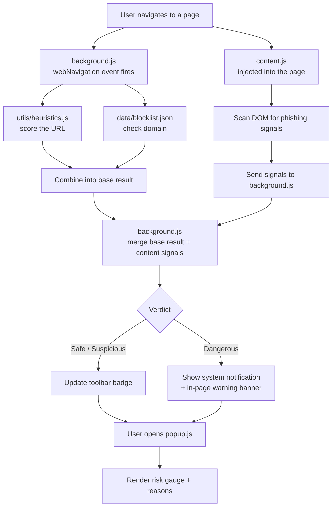

# Phishing Detector — Chrome Extension

Phishing sites are everywhere, and honestly, some of them are good enough
that even careful people click through them. I built this extension to see
how far I could get toward catching them automatically — without relying on
some third-party API doing all the work behind the scenes.

It's a Chrome extension (Manifest V3) that quietly watches the pages you
visit and flags the ones that look like phishing, using a mix of URL
heuristics, page-content checks, and a local blocklist. No servers, no
tracking — everything runs in your browser.

## What it does

- 🔍 **Looks at the URL itself** — raw IP addresses instead of domains, the
  classic `@` redirect trick, way too many subdomains, sketchy TLDs, no
  HTTPS, and domains that are *suspiciously* close to a real brand name
  (`paypa1.com`, `amaz0n-support.top` — you get the idea)
- 📄 **Looks at the actual page** — does the login form quietly submit to a
  totally different domain? Is there a password field sitting on a
  non-HTTPS page? Does the page say "PayPal" everywhere while the URL says
  otherwise?
- 🚫 **Checks against a blocklist** — a local list of known-bad domains
  (`data/blocklist.json`), built to be swapped out for a real feed like
  OpenPhish or PhishTank later on
- 🎚️ **Shows a proper risk gauge** — instead of a blunt "safe or not,"
  the popup shows where a site lands on a five-level scale from Very Low to
  Severe, along with the actual reasons it was flagged
- 🔔 **Actually warns you, unprompted** — if a page is dangerous, you don't
  have to remember to check the extension. You get a notification and a
  banner right on the page, with a one-click way to leave

## How it works

Roughly, here's the flow from "you open a tab" to "you get warned":



The URL gets scored the moment navigation happens, the page content gets
scanned separately once it's loaded, and the two results get merged. If
things look bad enough, you hear about it right away — you don't have to
go looking for trouble.

## Getting it running

1. Clone the repo:
   ```bash
   git clone https://github.com/<your-username>/phishing-detector-extension.git
   ```
2. Open Chrome and head to `chrome://extensions`
3. Flip on **Developer mode** (top right)
4. Click **Load unpacked** and point it at the project folder
5. Pin the extension, visit a site, and you should see it come to life

## Project structure

```
phishing-detector-extension/
├── manifest.json         # Extension config (Manifest V3)
├── background.js         # Service worker: runs checks on navigation
├── content.js             # Injected into pages: scans DOM for red flags
├── popup.html/.css/.js    # Toolbar popup UI
├── utils/heuristics.js    # Pure scoring functions (unit-testable)
├── data/blocklist.json    # Known-bad domains
└── icons/                 # Extension icons
```

## Testing the heuristics

I kept `utils/heuristics.js` deliberately free of any Chrome API calls, so
the scoring logic can be tested on its own — no browser required. Something
like this works fine with Jest:

```js
const { analyzeUrl } = require("./utils/heuristics");

test("flags typosquatted paypal domain", () => {
  const result = analyzeUrl("http://paypa1-secure-login.com");
  expect(result.verdict).not.toBe("safe");
});
```

## What I'd like to add next

This started as a learning project, so there's a lot of room to grow it
into something more serious:

- [ ] Hook into the Google Safe Browsing API for real-time reputation checks
- [ ] Domain age / WHOIS lookups (brand-new domains are a strong signal)
- [ ] Swap the static blocklist for a live OpenPhish/PhishTank feed
- [ ] Train a small ML classifier on URL features and run it in-browser
- [ ] Add a "this was wrong" button so false positives/negatives can be
      reported

## A quick disclaimer

This is a personal/portfolio project, not a production security product.
The heuristics are indicators, not guarantees — please still use your own
judgment on anything that looks even a little off.
